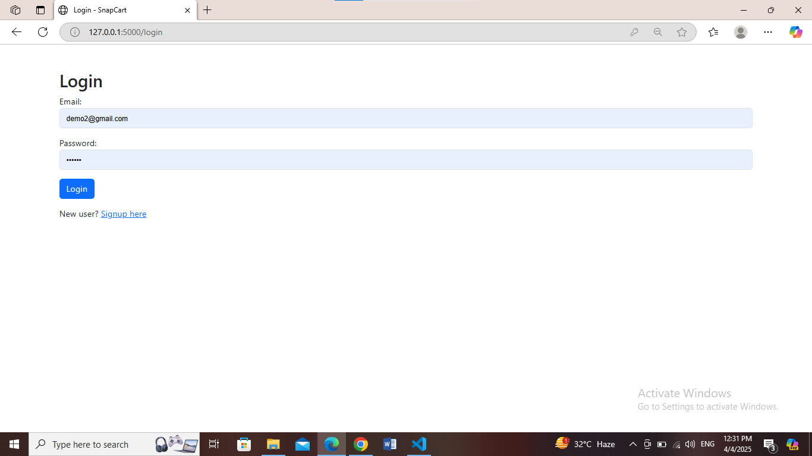
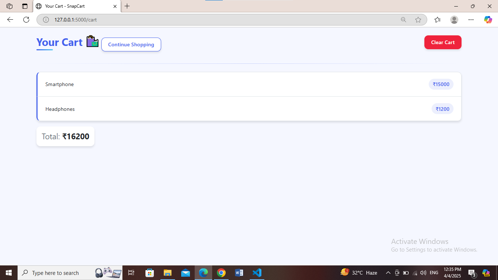


## **SnapCart - E-commerce Website** 🛒  

SnapCart is a simple **E-commerce website** built using **Flask**, **SQLite**, and **Jinja templates**. It supports **user authentication**, **cart functionality**, and a basic product listing system.  

---


### **📌 Features**  
✅ User Signup & Login Authentication  
✅ Product Listing with Prices  
✅ Add to Cart & View Cart Functionality  
✅ Session-based Cart Management  
✅ SQLite Database for User Storage  
✅ Flask-based Backend  

---

## **🚀 Getting Started**  

### **🔹 1. Clone the Repository**  
```bash
git clone https://github.com/your-username/SnapCart.git
cd SnapCart
```

### **🔹 2. Create and Activate Virtual Environment**  
#### **For Windows (CMD/PowerShell)**
```bash
python -m venv venv
venv\Scripts\activate
```
#### **For Mac/Linux**
```bash
python3 -m venv venv
source venv/bin/activate
```

---

## **📦 Install Dependencies**  
Run the following command to install required dependencies:  
```bash
pip install -r requirements.txt
```

---

## **💾 Database Setup**  
Initialize the database before running the project:  
```python
python
>>> from app import db
>>> with app.app_context():
>>>     db.create_all()
>>> exit()
```

---

## **▶️ Run the Flask Application**  
After setting up everything, start the Flask development server:  
```bash
flask run
```
OR  
```bash
python app.py
```
The app will run on:  
🔗 **http://127.0.0.1:5000/**  

---

## **📂 Project Structure**  

```
SnapCart/
├── app.py
├── venv/  # Virtual environment
├── snapcart.db  # SQLite database
├── requirements.txt
├── static/
│   ├── images/  # Store images like logo.png
│   ├── css/  # CSS files
│   ├── js/  # JavaScript files
├── templates/
│   ├── index.html
│   ├── login.html
│   ├── signup.html
│   ├── cart.html
├── README.md
```

---

## **📌 Add Static Images**  
Make sure the `static/images/` folder contains the **SnapCart logo** or product images.  

Example for displaying the logo:  
```html

```

---

## **📜 Dependencies**  
The project uses the following Python libraries:  

```txt
Flask==3.0.0
Flask-SQLAlchemy==3.0.5
```

To update dependencies, install them with:  
```bash
pip install -r requirements.txt
```

---

## **💡 Future Enhancements**  
🔹 Product Categories  
🔹 Payment Gateway Integration  
🔹 Order History  
🔹 Admin Dashboard  

---

## **💖 Contributing**  
Feel free to **fork** this repository and create a **pull request**! 🚀  

---

## **📜 License**  
This project is open-source and free to use.  

---

Now, add this file to your repository:  
```bash
git add README.md
git commit -m "Added project README"
git push origin main
```




